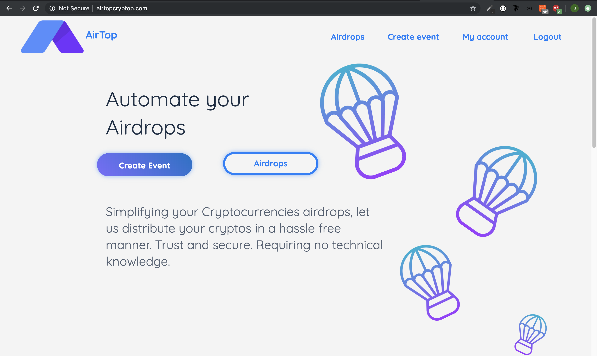
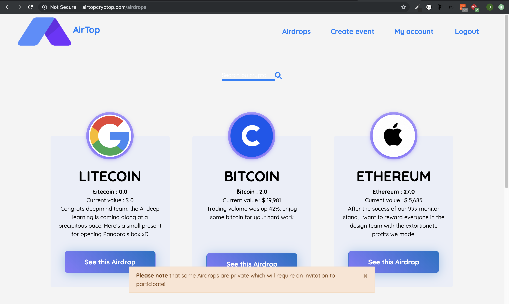

  # KEEP BUILDING
  
  Starting to the point that if you want to do an airdrop (in cryptocurrency) it's somehow complicated and takes a lot of time. I decided to automate. If you want to do a private airdrop to friends for example this plateform enable you to create and airdrop and send private invite to your friend and choose how you want to randomise the amount your airdrop and automate the send! 

  Link of the website : www.airtopcryptop.com (perhaps API call for the price in FIAT doesn't work anymore and also other API call....) 

  To make you save time some photos of the website : 

  
  

  
  

  
  

  
  

Legend
